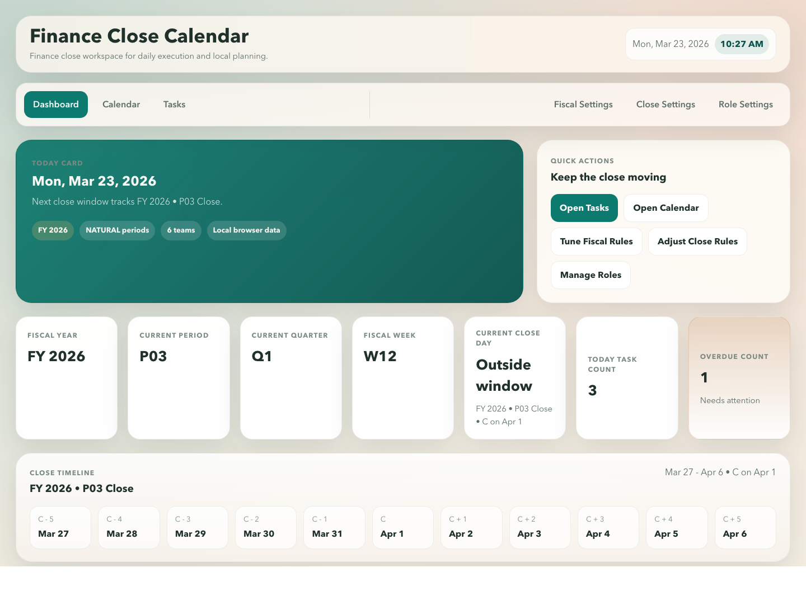
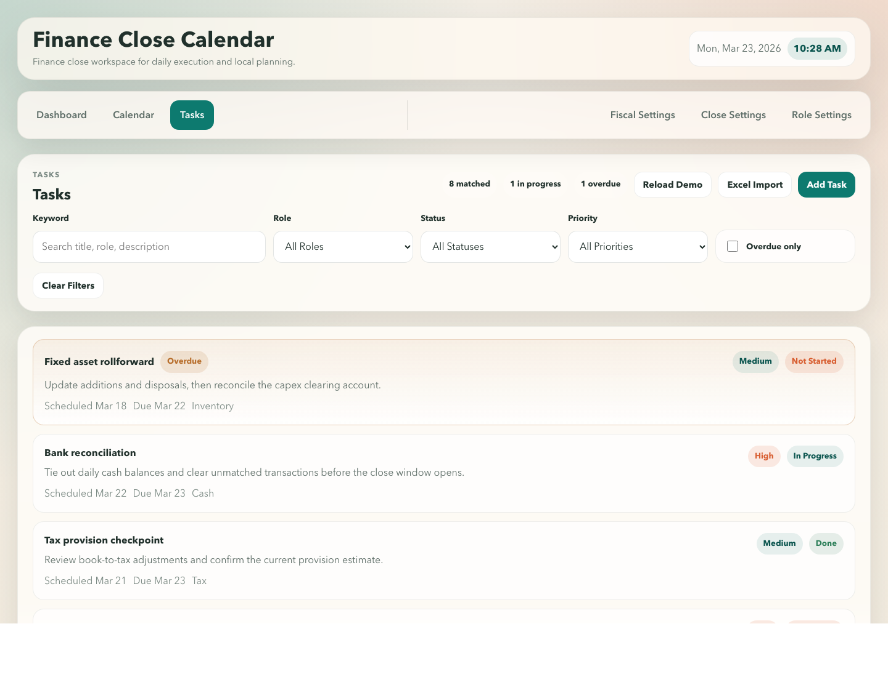
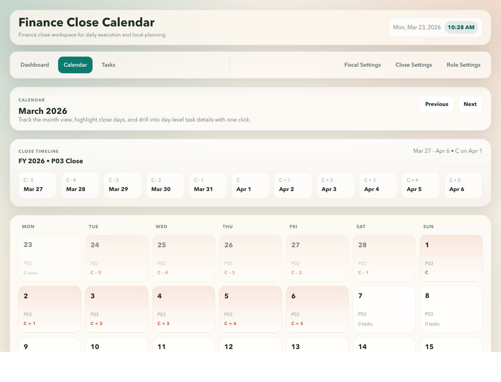
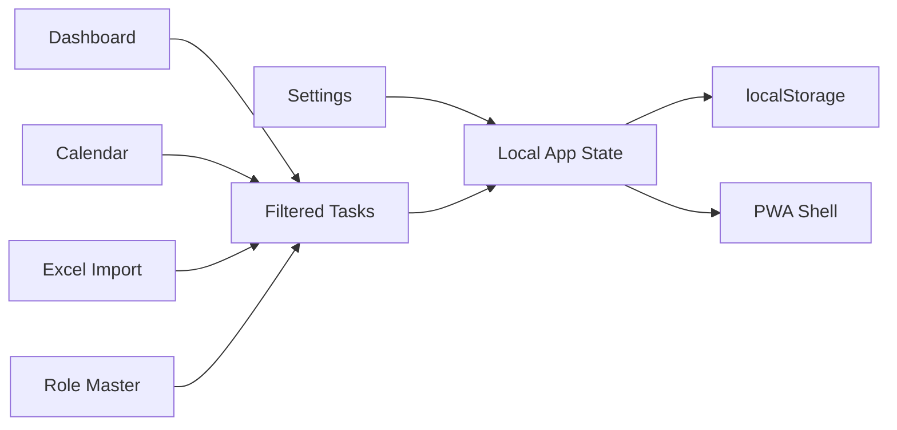

# Finance Close Calendar

[](./package.json)
[](https://react.dev/)
[](https://www.typescriptlang.org/)
[](./public/manifest.webmanifest)

> Local-first finance close planning workspace for fiscal calendars, close windows, task ownership, and daily execution.

Finance Close Calendar is a production-style MVP for finance teams that need a close management workspace without standing up a backend.

It combines fiscal setup, close-day planning, role ownership, task tracking, calendar visibility, Excel import, and offline-first local usage in one installable web app.

## Live Demo

- Demo: [https://yhpd123.github.io/finance-close-calendar/](https://yhpd123.github.io/finance-close-calendar/)
- Repository: [https://github.com/yhpd123/finance-close-calendar](https://github.com/yhpd123/finance-close-calendar)
- Latest Release: [v0.1.1](https://github.com/yhpd123/finance-close-calendar/releases/tag/v0.1.1)

## Ways To Use

### 1. Demo + PWA Install

Best for most finance users.

- Open the live demo: [https://yhpd123.github.io/finance-close-calendar/](https://yhpd123.github.io/finance-close-calendar/)
- In Chrome or Edge, click `Install App`
- Use it like a desktop app without Node.js or npm

### 2. Portable ZIP

Best for users who want a downloadable package without running commands.

- Download the portable package from the latest release
- Unzip the file
- On Windows, double-click `Start-Finance-Close-Calendar.bat`
- On macOS, double-click `Start-Finance-Close-Calendar.command`
- Use Chrome or Edge for the best experience

Portable package:

- [finance-close-calendar-portable.zip](https://github.com/yhpd123/finance-close-calendar/releases/download/v0.1.1/finance-close-calendar-portable.zip)

### 3. npm / Developer Mode

Best for internal developers or product teams who want to modify the project.

- `npm install`
- `npm run dev`
- `npm run build`

## Screenshots

### Dashboard



### Tasks



### Calendar



## Why This Project Exists

Many finance close processes still live across spreadsheets, chat threads, and manually maintained checklists. This prototype turns that workflow into a focused desktop-first workspace that helps teams:

- define fiscal and close rules clearly
- assign task ownership by functional role
- monitor progress and overdue items visually
- drill from dashboard metrics into concrete task lists
- keep working offline with browser-local data

## Target Users

- Finance controllership teams running monthly, quarterly, or year-end close
- Accounting operations teams that need a lightweight local task register
- Internal product teams prototyping close orchestration workflows
- Builders exploring a frontend-only finance operations tool

## What You Can Do

| Area | What it supports |
| --- | --- |
| Dashboard | Today card, fiscal context, close context, upcoming tasks, role progress, status mix, priority mix, overdue and drill-down analysis |
| Fiscal Settings | Fiscal start date, `natural` / `445` / `454` / `544` models, live preview of fiscal year output |
| Close Settings | Close day window rules like `C - 5` to `C + 5`, timeline visibility, close mapping preview |
| Calendar | Month view, today highlight, close-day highlight, task badges, day-level detail |
| Tasks | Compact list-first register, add/edit/delete, filter by keyword, role, status, priority, overdue |
| Role Settings | Role master maintenance, manual entry, Excel import, ownership mapping for tasks |
| PWA | Install prompt, service worker, offline open support, local browser persistence |

## Product Flow

1. Configure the fiscal calendar in **Fiscal Settings**
2. Define the close-day window in **Close Settings**
3. Create or import ownership roles in **Role Settings**
4. Add or import tasks in **Tasks**
5. Monitor execution in **Dashboard**
6. Use **Calendar** and drill-down filters for day-by-day and role-by-role analysis

## Experience Highlights

- Frontend-only architecture
- No backend
- No cloud dependency
- No login required
- Local browser storage
- Demo configuration and demo tasks seeded on first launch
- Excel template download before import
- PWA install support for desktop-like usage

## Architecture At A Glance



## App Modules

### Workspace Modules

- **Dashboard**
  - shows today context, current fiscal labels, close-day positioning, task health, and chart-style insights
  - supports drill-down into filtered task views

- **Calendar**
  - provides a month view with close-day highlighting and task density badges
  - lets users inspect a specific day in context

- **Tasks**
  - optimized for list-first review
  - supports add, edit, delete, compact filters, and Excel import

### Admin Modules

- **Fiscal Settings**
  - choose fiscal start date and period model
  - preview fiscal year output immediately

- **Close Settings**
  - configure close timeline offsets such as `C - 5` to `C + 5`
  - preview close mapping for the current month

- **Role Settings**
  - maintain finance ownership roles such as Revenue, Inventory, and Intercompany
  - import role masters from Excel

## Excel Import

Both **Tasks** and **Role Settings** include template download so users can confirm file structure before uploading.

### Task Import Columns

- `title`
- `description`
- `scheduledDate`
- `dueDate`
- `status`
- `priority`
- `role`

### Role Import Columns

- `name`
- `description`
- `color`

## Tech Stack

- React
- TypeScript
- Vite
- React Router
- CSS
- `xlsx`

## Getting Started

This repository can be used in three ways:

- Demo plus PWA install
- Portable ZIP
- npm for local development

### Requirements

- Node.js 20+ recommended
- npm

### Install

```bash
npm install
```

### Start Development Server

```bash
npm run dev
```

### Build Production Bundle

```bash
npm run build
```

### Preview Production Bundle

```bash
npm run preview
```

## How To Use

### 1. Set Fiscal Rules

Open **Fiscal Settings** and choose:

- fiscal start date
- fiscal period model

The preview updates immediately so finance users can validate the year structure before saving.

### 2. Set Close-Day Logic

Open **Close Settings** and define:

- close start rule
- close range from `C - n` to `C + n`
- whether the close timeline should stay visible on supporting pages

### 3. Prepare Ownership Roles

Open **Role Settings** and create or import roles such as:

- Revenue
- Inventory
- Intercompany
- Accounts Payable
- Fixed Assets

### 4. Load the Task Register

Open **Tasks** and either:

- add tasks manually
- download the template and import from Excel

### 5. Review Execution

Use **Dashboard** to:

- review today context
- see progress by role
- inspect overdue pressure
- drill into filtered task slices for action

## Local-First Behavior

This project stores app data in browser local storage. That means:

- no backend setup is required
- no account setup is required
- data stays on the local browser profile
- clearing browser storage will reset the app unless data is exported in a future version

## PWA Support

This repository includes:

- `manifest.webmanifest`
- `sw.js`
- offline fallback support
- install prompt handling

After launching in a supported browser, users can install the app for a more native desktop experience.

## Portable ZIP Support

This repository also supports a portable ZIP package for non-technical users.

- The app can run directly from an unzipped folder
- File mode uses hash routing for compatibility
- Service worker is skipped in portable mode
- Data still stays in the local browser profile on that device

## Project Structure

```text
src/
  components/      reusable UI building blocks
  context/         local app data state and persistence
  data/            demo seed data
  hooks/           install prompt and reusable hooks
  pages/           page-level screens
  pwa/             service worker registration
  styles/          theme and layout styles
  types/           domain models
  utils/           fiscal, close, calendar, Excel, storage, import helpers
public/
  icons/           PWA icons
  manifest.webmanifest
  offline.html
  sw.js
```

## Roadmap Toward Enterprise Edition

This MVP is intentionally simple and local-first. A production enterprise version would typically expand into:

- multi-entity and multi-ledger close management
- approval workflow and sign-off checkpoints
- ERP or data warehouse integrations
- SSO and role-based access control
- audit log and version history
- notification rules and SLA tracking
- collaboration comments and escalation workflows
- analytics for bottlenecks and close performance

## Contact

- Author: James
- Feedback and bug reports: [GitHub Issues](https://github.com/yhpd123/finance-close-calendar/issues)
- Questions and product discussion: [GitHub Discussions](https://github.com/yhpd123/finance-close-calendar/discussions)

## License

This project is available under the [MIT License](./LICENSE).
